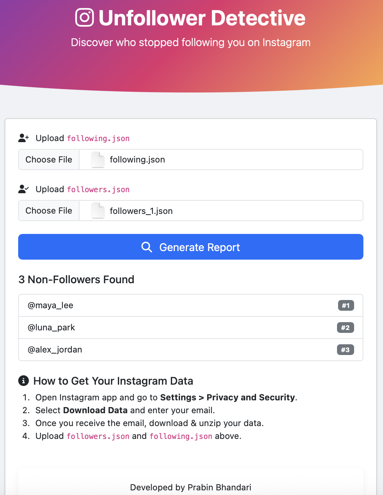

# Instagram Unfollower Checker

[](https://github.com/prabinbessie/instagram-unfollower-checker/releases)
[](LICENSE)

Find out who you follow on Instagram that doesn't follow you back. Upload your
Instagram data export and get the list in seconds — JSON, HTML, or the full ZIP.

🔗 **[Live demo](https://instagram-unfollower-checker-nm16.onrender.com)** — the
free host may take ~50s to wake up.



## Features

- Upload individual `following`/`followers` files **or** the complete Instagram ZIP
- JSON and HTML exports both supported, with automatic file detection
- Searchable lists, plus follow-back rate
- Export results as CSV or PDF
- Everything runs in memory — no data is stored

## Quick start

```bash
git clone https://github.com/prabinbessie/instagram-unfollower-checker.git
cd instagram-unfollower-checker

python -m venv .venv
source .venv/bin/activate          # Windows: .venv\Scripts\activate
pip install -r requirements.txt

python app.py                      # http://localhost:5001
```

Run the tests with `pytest`.

## Getting your Instagram data

1. Instagram → **Settings → Accounts Center → Your information and permissions →
   Download your information**.
2. Request **"Followers and following"** in **JSON** (recommended) or **HTML**.
3. When the email arrives, download the ZIP and upload it directly — or extract
   `following.*` and `followers_1.*` from `connections/followers_and_following/`
   and upload those two files.

## License

MIT — see [LICENSE](LICENSE).

Made by [Prabin Bhandari](https://github.com/prabinbessie).
