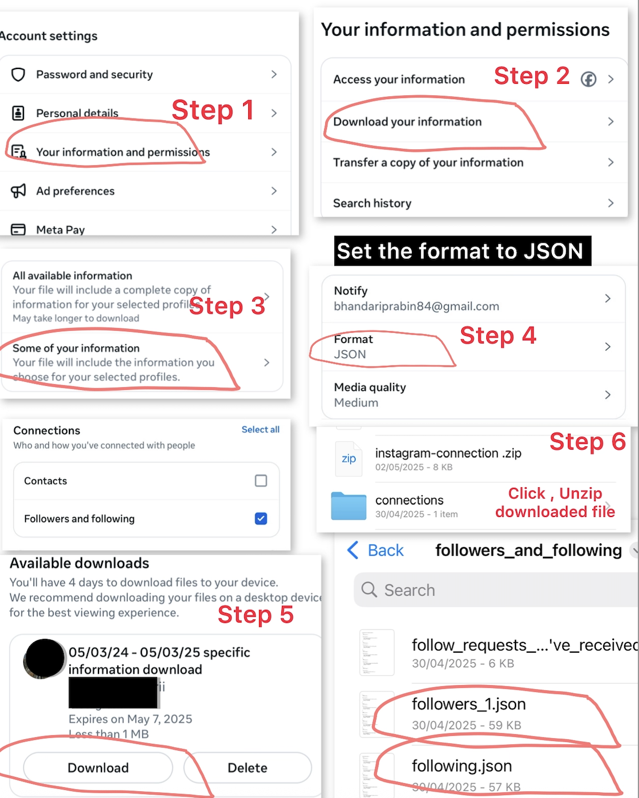

# 📊 Instagram Unfollower Checker

[](https://github.com/prabinbessie/instagram-unfollower-checker/releases)
[](LICENSE)
[](https://www.python.org/)
[](https://flask.palletsprojects.com/)
[](CONTRIBUTING.md)
[](http://makeapullrequest.com)

> **Discover who's not following you back on Instagram with this privacy-focused, easy-to-use web application.**

Ever wondered who among your 1000+ Following list isn't following you back? Manually checking each profile against your 10,000+ followers would take **hours or even days**. This powerful Flask-based web application does the heavy lifting for you in **seconds**.


Simply upload your Instagram data files, and our smart analyzer compares your followers and following lists to instantly identify non-reciprocal connections in a secure way. Built with privacy in mind - all processing happens locally with zero data collection and full control of yours.  
🔗 **[Try Live Demo](https://instagram-unfollower-checker-nm16.onrender.com)**
> **It will take upto 50 Second to load application**
***[Demo Link 2 (v3)](https://instagram-unfollower-checker.onrender.com)***


## Features

###  **Dual Format Support**
- **JSON Export**: Full compatibility with Instagram's JSON data format
- **HTML Export**: Parse Instagram's HTML data exports seamlessly
- **Smart Detection**: Automatically identifies and processes file formats
- **Dashboard with Charts**: Added a new analytics panel featuring interactive Chart doughnut and bar visualizations.

###  **Intelligent Processing**
- **Auto File Correction**: Detects and fixes reversed file uploads
- **Content Analysis**: Inspects both filenames and content for accurate processing
- **Error Recovery**: Handles malformed or incomplete data gracefully

###  **Modern Web Interface**
- **Responsive Design**: Perfect on desktop, tablet, and mobile devices
- **Real-time Results**: Instant analysis with live progress indicators
- **Interactive Links**: Clickable Instagram profile links for easy access
- **Clean UI**: Intuitive interface with smooth animations

###  **Professional Reporting**
- **PDF Generation**: Create downloadable PDF reports with embedded links
- **Styled Output**: Clean, professional layout for sharing
- **Export Options**: Multiple format support for data portability 

###  **Privacy & Security First**
- **Zero Data Storage**: No data saved on servers or databases
- **Local Processing**: All analysis happens in memory during your session
- **No API Calls**: Completely offline processing, no external dependencies
- **Secure Headers**: Modern security practices implemented

---

##  Quick Start

### Prerequisites
- Python 3.9 or higher
- pip package manager

### Installation

1. **Clone the repository**
   ```bash
   git clone https://github.com/prabinbessie/instagram-unfollower-checker.git
   cd instagram-unfollower-checker
   ```

2. **Set up virtual environment**
   ```bash
   # Create virtual environment
   python -m venv venv
   
   # Activate environment
   # On Linux/macOS:
   source venv/bin/activate
   
   # On Windows:
   .\venv\Scripts\activate
   ```

3. **Install dependencies**
   ```bash
   pip install -r requirements.txt
   ```

4. **Launch the application**
   ```bash
   flask run --port 5000 --debug
   ```

5. **Open your browser**
   ```
   http://localhost:5000
   ```

---

##  Getting Your Instagram Data

### Step-by-Step Guide

1. **Access Instagram Settings**
   - Open Instagram on web or mobile
   - Go to **Settings** → **Privacy and Security** → **Data Download**

2. **Request Your Data**
   - Select **"Connections"** or **"Following and Followers"**
   - Choose format: **JSON** (recommended) or **HTML**
   - Enter your email address
   - Click **"Request Download"**

3. **Download Your Files**
   - Wait for Instagram's email (usually 24-48 hours)
   - Download the ZIP file from the email link
   - Extract the archive

4. **Locate Required Files**
   - `followers_1.json` or `followers.html`
   - `following.json` or `following.html`



###  Pro Tips
- **JSON format** provides more detailed information and faster processing
- Keep your data files secure and delete them after analysis
- The download process may take longer for accounts with many followers

---

##  What You'll Discover

### Analysis Results Include:
- **Complete list** of accounts you follow that don't follow back
- **Direct profile links** for easy access to each account
- **Total count** of non-reciprocal follows
- **Detailed statistics** about your following patterns

### Export Options:
- **Web View**: Interactive, mobile-friendly results page
- **PDF Report**: Professional document with embedded links
- **Raw Data**: Access to processed information for further analysis


---

##  Technical Architecture

```
instagram-unfollower-checker/
├── static/
│   └── css/
├── templates/
├── sample_json/           
│   ├── followers.json
│   └── following.json
├── tests/
├── .gitignore
├── CHANGELOG.md
├── Procfile
├── README.md
├── LICENSE
├── app.py
├── requirements.txt
└── version.py
```

###  Built With
- **Flask** - Lightweight web framework
- **ReportLab** - PDF generation
- **Bootstrap** - Responsive UI components
- **JavaScript** - Interactive functionality

---

##  API Reference

### Core Analyzer Class
```python
from analyzer import InstagramAnalyzer

analyzer = InstagramAnalyzer()
result = analyzer.analyze_files(followers_file, following_file)
```

### Configuration Options
- **File size limit**: 50MB per file
- **Supported formats**: JSON, HTML
- **Memory usage**: Optimized for large datasets
- **Processing timeout**: 30 seconds maximum

---

##  Testing

Run the test suite to ensure everything works correctly:

```bash
# Run all tests
python -m pytest Test/

# Run with coverage
python -m pytest Test/ --cov=app

# Run specific test file
python -m pytest Test/test_app.py
```

---

## Changelog

### v4.5.0 — Latest Release

####  **New Features**
- **Analytics Dashboard**  
  - New detailed dashboard panel showing breakdowns for:
    - Mutual Followers  
    - Non-Followers (users you follow who don’t follow back)  
    - Not-Following-Back (users who follow you but you don’t follow)  
    - Follow-Back Ratio (%)  
  - Interactive Chart graphs for:
    - Relationship Breakdown (doughnut)  
    - Follow Comparison (bar)  
- **CSV Export**  
  - Added export buttons for multiple data types:
    - `non_followers`  
    - `not_following_back`  
    - `all_following`  
  - Downloads CSV files directly from the dashboard  
- **PDF Report**  
  - “Download PDF Report” button now accessible from both summary results and dashboard

### Changed
- **UI & Layout**  
  - Refactored `style.css` to leverage flex and CSS grid for fully responsive views  
  - Restyled upload cards, file-drop zones and result panels for better clarity on mobile and desktop  
  - Improved tab styling and active-state indicator for user-lists  
- **UX Improvements**  
  - Always-clear previous results on file-select or “Clear” button click  
  - Smooth scroll to dashboard on analysis completion  
  - Real-time “Preparing CSV…” progress text

[View full changelog](CHANGELOG.md)

---

##  Contributing

I love contributions! Here's how you can help make this project even better:

###  Ways to Contribute
- **Report bugs** by opening detailed issues
- **Suggest features** that would improve user experience
- **Submit pull requests** with code improvements
- **Improve documentation** and help others understand the project
- **Share the project** with others who might find it useful

###  Development Workflow

1. **Fork the repository**
   ```bash
   git clone https://github.com/YOUR_USERNAME/instagram-unfollower-checker.git
   ```

2. **Create a feature branch**
   ```bash
   git checkout -b feature/your-new-feature
   ```

3. **Make your changes**
   - Follow PEP-8 style guidelines
   - Add type hints where appropriate
   - Include comprehensive tests
   - Update documentation

4. **Test your changes**
   ```bash
   python -m pytest tests/
   ```

5. **Commit and push**
   ```bash
   git commit -m "feat: add your new feature"
   git push origin feature/your-new-feature
   ```

6. **Create a Pull Request**
   - Provide a detailed description
   - Reference any related issues
   - Include screenshots if applicable

###  Development Guidelines
- **Code Style**: Follow PEP-8 conventions
- **Testing**: Maintain >90% code coverage
- **Documentation**: Update README and inline docs
- **Commits**: Use conventional commit messages

---

##  Privacy & Security

###  **Data Protection**
- **No data collection**: We never store, access, or transmit your Instagram data
- **Local processing**: All analysis happens in your browser/server memory
- **Session-based**: Data is automatically cleared when you close the app
- **No tracking**: No analytics, cookies, or user tracking

###  **Security Features**
- **File validation**: Strict file type and size checking
- **Memory management**: Automatic cleanup after processing
- **Secure headers**: HTTPS enforcement and security headers
- **Input sanitization**: Protection against malicious file uploads

###  **Best Practices**
- Delete downloaded Instagram data files after analysis
- Use the tool on trusted networks only
- Keep your Instagram account credentials secure
- Regularly review your Instagram privacy settings

---

##  Support & FAQ

### ❓ **Frequently Asked Questions**

**Q: Is this tool safe to use?**
A: Yes! The tool processes data locally and doesn't connect to Instagram or store any information.

**Q: How long does Instagram data download take?**
A: Usually less than hour, but can vary depending on account size and Instagram's processing queue.

**Q: What if I get an error during analysis?**
A: Check that you've uploaded the correct files (followers and following data) and that they're not corrupted.

**Q: Can I use this for business accounts?**
A: Absolutely! The tool works with any Instagram account type.

###  **Found a Bug?**
1. Check existing [issues](https://github.com/prabinbessie/instagram-unfollower-checker/issues)
2. Create a new issue with detailed description
3. Include error messages and steps to reproduce

###  **Feature Requests**
Always looking to improve! Submit feature requests through GitHub issues.

---

##  License

This project is licensed under the **MIT License** - see the [LICENSE](LICENSE) file for full details.

### What this means:
- ❌ **Commercial use** -  Not allowed. You may not use this for financial or business-related gain
- ✅ **Modification** - Modify and adapt the code
- ✅ **Distribution** - Share and distribute freely
- ✅ **Private use** - Use for personal projects
- ⚠️ **Liability** - No warranty provided

---

##  Author & Contact

**Prabin Bhandari**

-  **Email**: [em8een@gmail.com](mailto:em8een@gmail.com)
-  **Instagram**: [@prabinbhandarii](https://instagram.com/prabinbhandarii)
-  **GitHub**: [@prabinbessie](https://github.com/prabinbessie)

---

## 🌟 Show Your Support

If this project helped you, please consider:

- ⭐ **Starring the repository** on GitHub
- 🐛 **Reporting bugs** to help improve the tool
- 💡 **Suggesting features** for future development
- 🤝 **Contributing code** to make it even better
- 📢 **Sharing with friends** who might find it useful

---

<div align="center">

**Made with ❤️ by [Prabin Bhandari](https://github.com/prabinbessie)**

*Helping you understand your Instagram connections better*

[](https://github.com/prabinbessie/instagram-unfollower-checker)
[](https://github.com/prabinbessie)

</div>